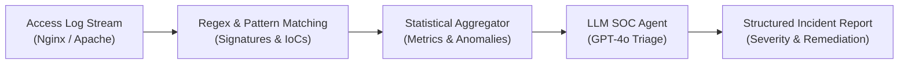

# net_log_analyzer

Automated security log parser and incident triage engine powered by LLMs. Detects anomalous access patterns, extracts IoCs, and outputs structured SOC incident reports.

---

# Net Log Analyzer & AI Incident Triager

An automated security telemetry parser and incident triage engine written in Python. This tool ingests web and network server access logs, aggregates traffic metrics, detects common adversary reconnaissance signatures, and orchestrates an LLM-based agent to produce actionable, structured incident response reports mapped to defensive frameworks.

---

## Architecture Overview



---

## Key Features

* **Automated Signature Inspection:** Identifies common application-layer attack vectors including:
* Directory traversal (`../`, `..\`)
* SQL Injection (SQLi) patterns
* Cross-Site Scripting (XSS) injection attempts
* Unauthorized system file targets (`/etc/passwd`, `/bin/sh`)
* Sensitive configuration scraping (`.env`, `config.json`)


* **Telemetry Aggregation:** Summarizes total traffic volume, unique source IP distribution, status code distributions, and top offending endpoints.
* **LLM-Powered SOC Triage:** Translates raw metrics and anomaly snippets into an executive-ready Markdown incident report featuring:
* Calculated threat severity (`LOW`, `MEDIUM`, `HIGH`, `CRITICAL`)
* Extracted Indicators of Compromise (IoCs)
* MITRE ATT&CK technique mapping
* Actionable mitigation strategies (firewall rules, WAF signatures, rate limits)


---

## Installation & Setup

### 1. Clone the Repository

```bash
git clone https://github.com/alejandro-0332/net_log_analyzer.git
cd net_log_analyzer

```

### 2. Set Up a Virtual Environment

```bash
python -m venv venv
source venv/bin/activate  # On Windows: venv\Scripts\activate

```

### 3. Install Dependencies

```bash
pip install -r requirements.txt

```

### 4. Configure Environment Variables

Create a `.env` file in the root directory and add your OpenAI API key:

```env
OPENAI_API_KEY="your-api-key-here"

```

---

## Usage

1. Place your target log file in the project directory as `sample_access.log` (or run the script directly to execute with the built-in synthetic test dataset).
2. Execute the analyzer:

```bash
python analyzer.py

```

3. Once processing finishes, the generated assessment will be exported directly to `incident_report.md`.

---

## Sample Output

The resulting `incident_report.md` provides structured triage output ready for SOC escalation:

> ### Executive Summary & Calculated Threat Level
> 
> 
> **Threat Level:** HIGH
> Multiple reconnaissance probes and unauthorized file retrieval attempts detected from remote IP `203.0.113.195`.
> ### Indicators of Compromise (IoCs)
> 
> 
> * **Malicious IP:** `203.0.113.195`
> * **Targeted Endpoints:** `/../../etc/passwd`, `/.env`, `/login`
> 
> 
> ### MITRE ATT&CK Mapping
> 
> 
> * **T1083 - File and Directory Discovery:** Attempted access to standard Unix credential paths.
> * **T1190 - Exploit Public-Facing Application:** Input tampering signatures detected via SQLi vectors.
> 
> 
> ### Recommended Remediation
> 
> 
> 1. Block `203.0.113.195` at the edge firewall / WAF.
> 2. Implement strict rate-limiting policies on `/login` endpoints.
> 3. Verify server permissions on sensitive configuration artifacts.
> 
> 

---

## License

This project is licensed under the MIT License - see the LICENSE file for details.
